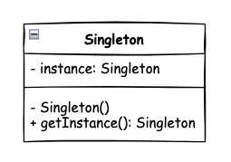
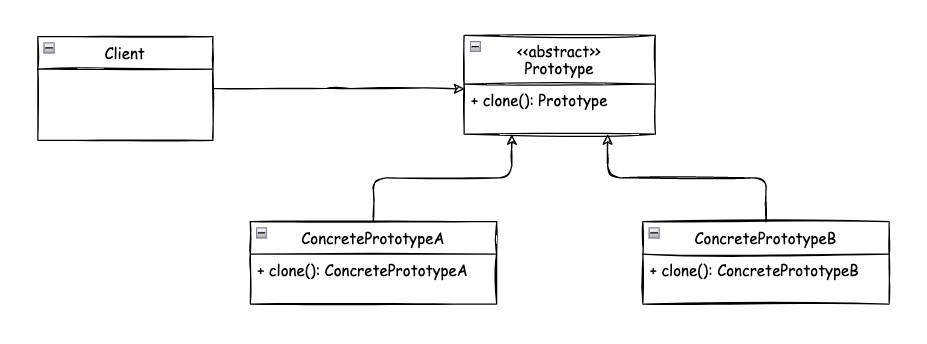
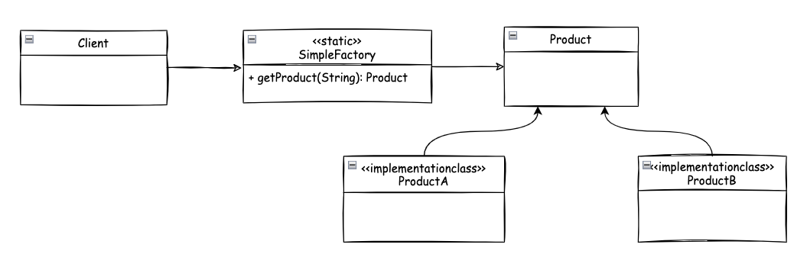
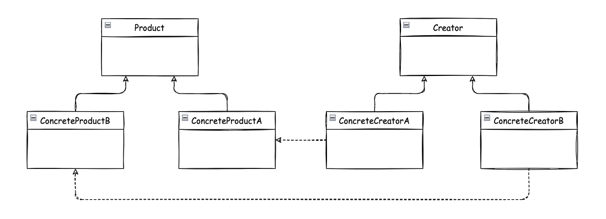
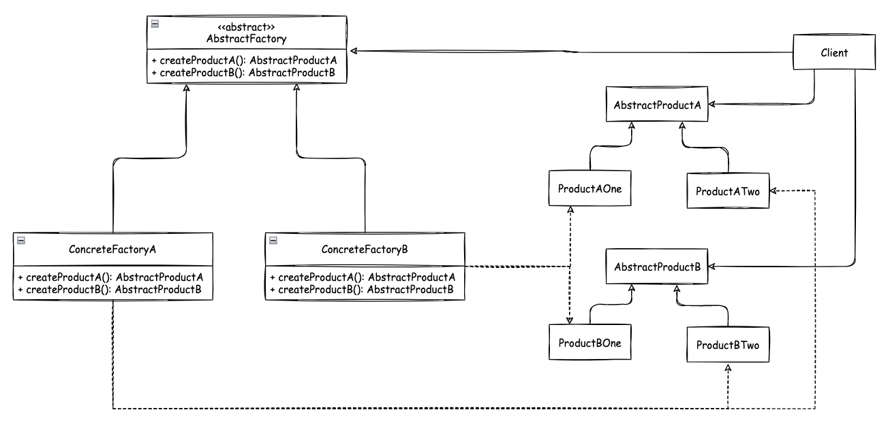
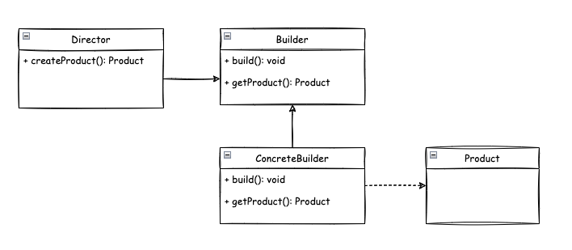
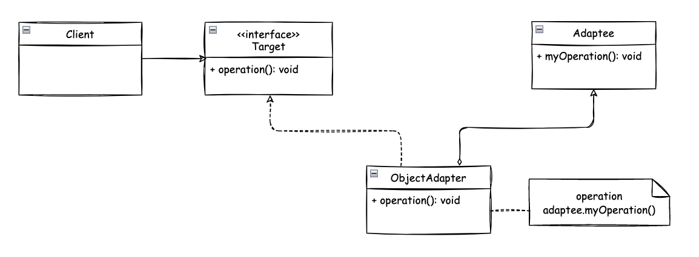
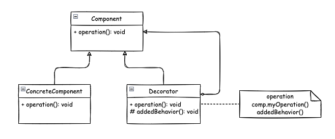
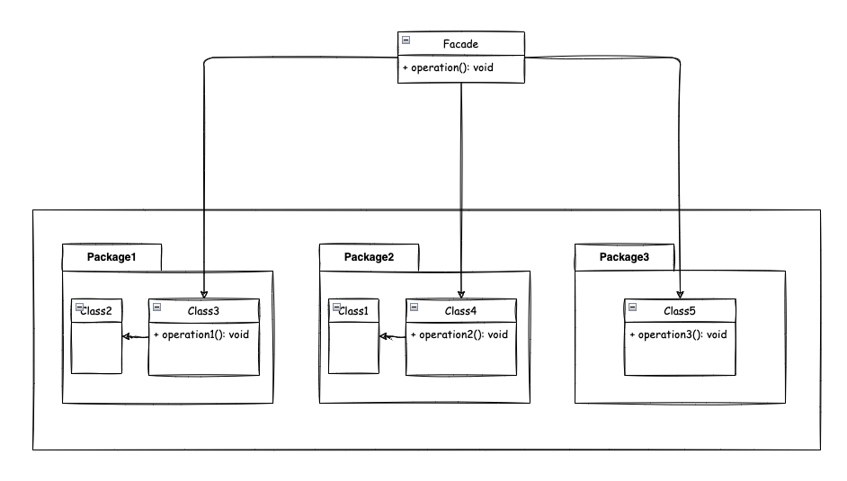

# Design Patterns

- [Creational Patterns](#creational-patterns)
  * [Singleton](#singleton)
  * [Prototype](#prototype)
  * [Simple Factory](#simple-factory)
  * [Factory Method](#factory-method)
  * [Abstract Factory](#abstract-factory)
  * [Builder](#builder)
- [Structural Patterns](#structural-patterns)
  * [Adapter](#adapter)
  * [Decorator](#decorator)
  * [Facade](#facade)
- [Behavioral Patterns](#behavioral-patterns)
  * [Command](#command)
  * [Observer](#observer)
  * [Strategy](#strategy)
  * [Mediator](#mediator)
  * [Chain of Responsibility](#chain-of-responsibility)

## Creational Patterns

### [Singleton](https://github.com/gouravdey/Design-Patterns/tree/master/src/com/gd/creational/singleton)
- A singleton class has only one instance, accessible globally through a single point (via a method/field)
- Main problem this pattern solves is to ensure that only a single instance of this class exists
- Any state you add in your singleton becomes part of "global state" of your application

#### UML Diagram

#### Implementation Steps
**Plan**
- Controlling instance creation
  - Class constructor(s) must be not be accessible globally
  - Subclassing/inheritance must not be allowed
- Keeping track of instance
  - Class itself is a good place to track the instance
- Giving access to the singleton instance
  - A public static method is good choice
  - Can expose instance as final public static field, but it won't work for all singleton implementations.

**Steps**
1. Declare the constructor of the class as private 
2. Declare a static method
3. Declare a static member of the same class type in the class

**Options**
- Early initialization - Eager Singleton
  - Create singleton as soon as class is loaded
- Lazy initialization - Lazy Singleton
  - Singleton is created when is first required

#### Issues
1. Multi-threaded environment
2. Serialization and Deserialization
3. Cloning
4. Reflection

---

### Prototype
- We have a complex object that is costly to create. To create more instances of such class, we use an existing instance as our prototype.
- Prototype will allow us to make copies of existing object & save us from having to recreate objects from scratch.

#### UML Diagram

#### Implementation Steps
**Steps**
- We start by creating a class which will be a prototype
  - The class must implement Cloneable interface
  - Class should override clone method and return copy of itself
  - The method should declare CloneNotSupportedException in throws clause to give subclass chance to decide on whether to support cloning.
- Clone method implementation should consider the deep and shallow copy and choose whichever is applicable.

---

### Simple Factory
- Here we simply move the instantiation logic to a separate class and most commonly to a static method of this class
- Some do not consider simple factory to be a "design pattern" as it is simply a method that encapsulates object instantiation.
- Typically, we want to do this if we have more than one option when instantiating object and a simple logic is used to choose correct class.

#### UML Diagram

#### Implementation Steps
**Steps**
- Start by creating a separate class for our simple factory
  - Add a method which returns desired object instance
    - This method is typically static and will accept some argument to decide which class to instantiate
    - Additional arguments can also be provided which will be used to instantiate objects.

---

### Factory Method
- We want to move the object creation logic from our code to a separate class.
- We use this pattern when we do not know in advance which class we may need to instantiate beforehand and also to allow new classes to be added to system and handle their creation without affecting client code.
- We let subclasses decide which object to instantiate by overriding the factory method.

#### UML Diagram

#### Implementation Steps
**Steps**
- We start by creating a class for our creator
  - Creator itself can be concrete if it can provide a default object, or it can be abstract.
  - Implementations will override the method and return an object.

---

### Abstract Factory
- Abstract factory is used when we have two or more objects which work together forming a kit or set and there can be multiple sets or kits that can be created by client code.
- So we separate client code from concrete objects forming such a set and also from the code which creates these sets.

#### UML Diagram

#### Implementation Steps
**Steps**
- We start by studying the product "sets"
  - Create abstract factory as an abstract class or an interface.
  - Abstract factory defines abstract methods for creating products.
  - Provide concrete implementation of factory for each set of products.
- Abstract factory makes use of factory method pattern. We can think of abstract factory as an object with multiple factory methods.

---

### Builder
- We have a complex process to construct an object involving multiple steps, then builder design pattern can help us.
- In builder, we remove the logic related to object construction from "client" code & abstract it in separate classes.

#### UML Diagram

#### Implementation Steps
**Steps**
- We start by creating a builder
  - Identify the "parts" of the product & provide methods to create those parts
  - It should provide a method to "assemble" or build the product/object
  - It must provide a way/method to get fully built object out. Optionally builder can keep reference to a product it has built so the same can be returned again in future.
- A director can be a separate class or client can play the role of director.

---

## Structural Patterns

### Adapter
- We have an existing object which provides the functionality that client needs. But client code cannot use this object because it expects an object with different interface.
- Using adapter design pattern, we make this existing object work with client by adapting the object to client's expected interface.
- This pattern is also called as wrapper as it "wraps" existing object.

#### UML Diagram
**Class Adapter**

**Object Adapter**

#### Implementation Steps
**Steps**
- We start by creating a class for Adapter
  - Adapter must implement the interface expected by client
  - First we are going to try out a class adapter by also extending from our existing class
  - In the class adapter implementation, we are simply going to forward the method to another method inherited from adaptee.
  - In the object adapter implementation, we are only going to implement target interface and accept adaptee as constructor argument in adapter i.e. make use of composition.
- An object adapter should take adaptee as an argument in constructor or as a less preferred solution, you can instantiate it in the constructor thus tightly coupling with a specific adaptee.

---

### Decorator
- When we want to enhance behavior of our existing object dynamically as and when required then we use decorator design pattern.
- Decorator wraps an object within itself and provides same interface as the wrapped object. So the client of original object doesn't need to change.
- A decorator provides alternative to subclassing for extending functionality of existing classes.

#### UML Diagram

#### Implementation Steps
**Steps**
- We start with our component.
  - Component defines interface needed or already used by client.
  - Concrete component implements the component.
  - We define our decorator. Decorator implements component and also needs reference to concrete component.
  - In decorator methods we provide additional behavior on top that provided by concrete component instance.
- Decorator can be abstract as well and depend on subclasses to provided functionality.

---

### Facade
- Client has to interact with a large number of interfaces and classes in a subsystem to get result. So client gets tightly coupled with those interfaces and classes. Facade solves this problem.
- Facade provides a simple and unified interface to a subsystem. Client interacts with just the facade now to get same result.
- Facade is NOT just one to one method forwarding to other classes.

#### UML Diagram

#### Implementation Steps
**Steps**
- We start by creating a class that will server as a facade
  - We determine the overall "use cases"/ tasks that the subsystem is used for.
  - We write a method that exposes each "use case" or task.
  - This method takes care of working with different classes of subsystem.

## Behavioral Patterns

### Command
### Observer
### Strategy
### Mediator
### Chain of Responsibility